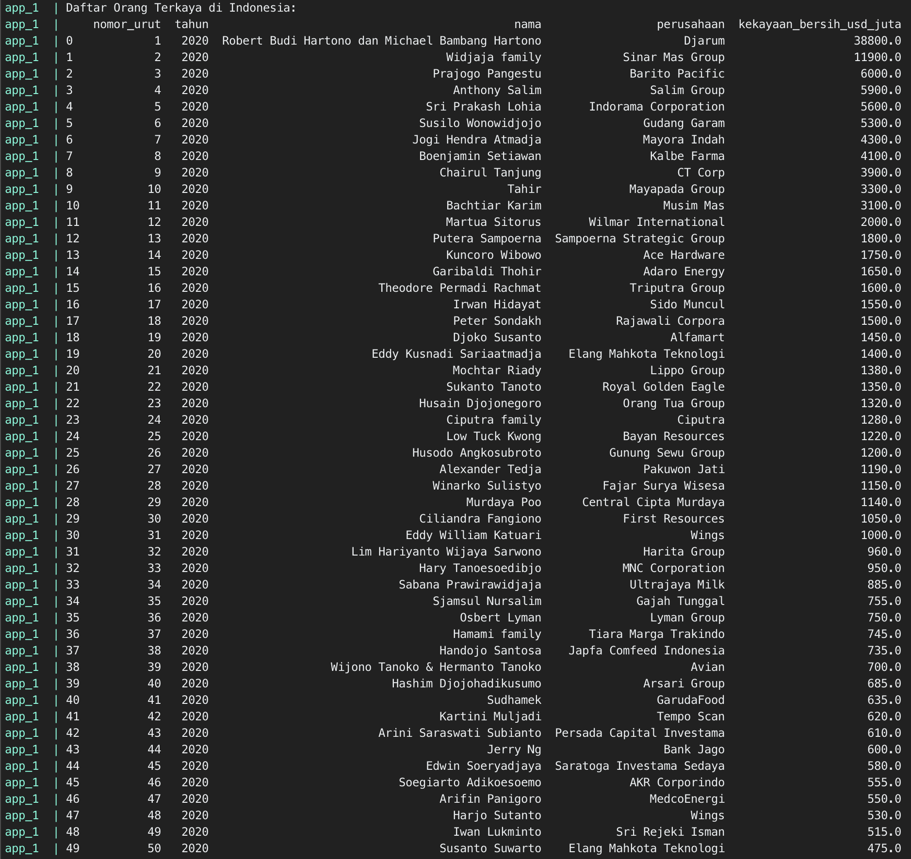

## Belajar Web Scraping

## Requirements
- Docker

## How to Run
- build docker image dengan command `docker-compose -f docker-compose.yml build`
- jalankan aplikasi dengan command `docker-compose -f docker-compose.yml up`
- matikan aplikasi dengan command `docker-compose -f docker-compose.yml down`

## Sample Output
